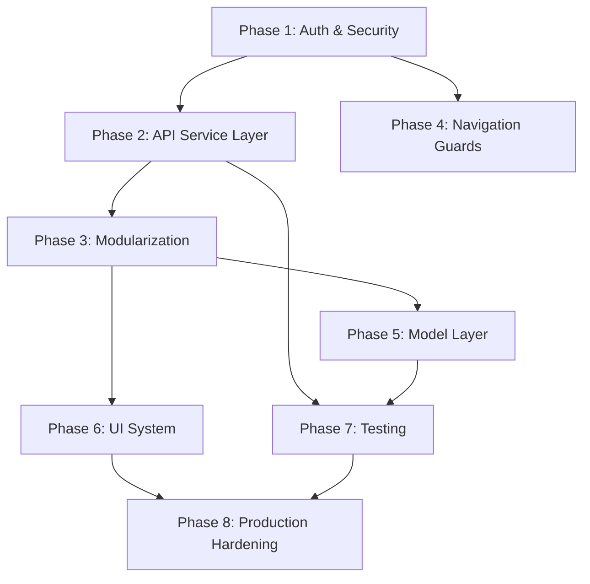

# Wheelboard Flutter — Complete Architecture Audit & Modernization Plan

## Executive Summary

**Codebase stats:** 242 Dart files, ~2.88 MB of source code across 11 top-level directories under `lib/`.

The Wheelboard Flutter app is a functional production logistics platform supporting 3 user roles (Professional, Transport Company, Service Provider) with complex workflows spanning trips, jobs, fleet management, leasing, KYC, payments, and social feeds. However, it suffers from **critical security vulnerabilities**, **complete API contract misalignment** with the modernized NestJS backend, **no token-based auth**, and significant architectural debt.

> [!CAUTION]
> **The app currently talks to a LEGACY API** (`api/User/login`, `api/User/send-otp`) while the backend has been fully migrated to a new auth system (`api/auth/login`, `api/auth/request-otp`). The mobile app is operating on deprecated endpoints that may break at any time.

---

## 1. Architecture Understanding

### Current Directory Structure
```
lib/
├── main.dart                    # Entry point + SplashScreen
├── apihelperclass/              # Single HttpHelper class (raw http package)
│   └── api_helper.dart
├── services/                    # Auth, Config, Profile, Payment, Razorpay
├── controllers/                 # GetX controllers by role
│   ├── Professional/ (12)
│   ├── ServiceProvider/ (3)
│   └── Transport/ (29)
├── screens/                     # UI screens by role
│   ├── auth/ (9 files)
│   ├── CompanyTransport/ (48 files)
│   ├── CompanyServiceProvider/ (10 files)
│   ├── Professional/ (35 dirs + wrapper)
│   └── shared/ (1 file)
├── models/ (36+ files)
├── utils/ (13 files)
├── widgets/ (2 files)
├── commonwidget/ (7 files)
├── constants/ (1 file)
├── enums/ (1 file)
└── theme/ (1 file)
```

### State Management
- **GetX** (`get: ^4.6.6`) used exclusively
- `AuthService` is a `GetxService` registered via `Get.put()` in `main()`
- Controllers per-role in `controllers/` — 44 total controllers
- Observable state (`Rx*`) used throughout
- No dependency injection framework — all manual `Get.put()` / `Get.find()`

### Navigation
- `GetMaterialApp` with imperative navigation (`Get.to()`, `Get.offAll()`)
- `NavigationHelper` does string-comparison routing based on `userType`
- 3 separate `MainWrapper` screens with separate bottom navigations
- No named routes, no route guards, no deep linking

### API Layer
- **Raw `http` package** — no Dio, no interceptors
- Single static `HttpHelper` class with generic `getData/postData/putData/deleteData`
- **No auth token injection** — headers passed manually per-call
- **No refresh token flow** — tokens stored but never refreshed
- **No centralized error handling at HTTP level**
- Mixed concerns: `HttpHelper` contains `formatDate()`, `formatAmount()`, business-specific methods

---

## 2. Critical Security Audit

### 🔴 CRITICAL Vulnerabilities

| # | Issue | Severity | Location |
|---|-------|----------|----------|
| 1 | **Auth tokens stored in SharedPreferences (plaintext)** | 🔴 CRITICAL | `session_manager.dart` — tokens readable by any root/backup tool |
| 2 | **Production URL uses HTTP not HTTPS** | 🔴 CRITICAL | `config.dart` L6: `http://api.wheelboard.in/` |
| 3 | **No Bearer token auth** — APIs use `UserId` header or no auth | 🔴 CRITICAL | `profile_service.dart` L12-13, all controllers |
| 4 | **Live API keys committed to `.env` in repo** | 🔴 CRITICAL | `.env` — Razorpay live key, Google Maps key in source |
| 5 | **No token expiration handling** — stale tokens used forever | 🔴 CRITICAL | `auth_service.dart` — no expiry check |
| 6 | **Debug test credentials hardcoded** | 🟡 HIGH | `login.dart` L241-271 — real phone numbers in debug buttons |
| 7 | **Commented-out SSL bypass code in main.dart** | 🟡 HIGH | `main.dart` L12-28 — `MyHttpOverrides` |
| 8 | **No certificate pinning** | 🟡 HIGH | No SSL pinning anywhere |
| 9 | **Session dump uses `print()` in production** | 🟡 MEDIUM | `session_manager.dart` L89 |
| 10 | **Token logged to console** | 🟡 MEDIUM | `auth_service.dart` L83, L109 |

### 🔴 API Contract Mismatch (Backend vs Mobile)

| Feature | Backend (NestJS) | Mobile App | Status |
|---------|-----------------|------------|--------|
| Login endpoint | `POST /api/auth/login` | `POST api/User/login` | ❌ MISMATCH |
| Login payload | `{ identifier, password }` | `{ mobileNo, password }` | ❌ MISMATCH |
| OTP request | `POST /api/auth/request-otp` | `POST api/User/send-otp` | ❌ MISMATCH |
| OTP login | `POST /api/auth/login/otp` | `POST api/User/login-with-otp` | ❌ MISMATCH |
| Registration | `POST /api/auth/register` | `POST api/User/company_signup` | ❌ MISMATCH |
| Auth response | `{ user, tokens: { accessToken, refreshToken } }` | `{ data: { token, userId } }` | ❌ MISMATCH |
| Token transport | `Authorization: Bearer <jwt>` | `UserId` header / no auth | ❌ MISMATCH |
| Logout | `POST /api/auth/logout` (server-side) | Client-only clear | ❌ MISMATCH |
| Refresh token | `POST /api/auth/refresh` | Not implemented | ❌ MISSING |
| Session mgmt | Per-device sessions in SQL | None | ❌ MISSING |
| Password reset | 3-step OTP flow | Incomplete | ❌ PARTIAL |

---

## 3. Technical Debt Analysis

### Architecture Issues
1. **God class**: `HttpHelper` mixes HTTP, date formatting, business logic
2. **No service layer separation**: Controllers directly call `HttpHelper` with raw JSON parsing
3. **Duplicated auth header logic**: Every controller manually constructs headers
4. **No model serialization standard**: Mix of manual `fromJson`/`toJson`, no code generation
5. **Monster screen files**: `dashboard.dart` (60KB), `trips_screen.dart` (63KB), `vehicle_detail_screen.dart` (58KB)
6. **No separation of concerns**: Business logic embedded in UI widgets
7. **Controllers under `Transport/` namespace**: 29 controllers including login, signup, jobs — not transport-specific

### Dependency Risks
| Package | Version | Risk |
|---------|---------|------|
| `http` | ^1.2.1 | No interceptors, should migrate to `dio` |
| `shared_preferences` | ^2.2.2 | Insecure for tokens — need `flutter_secure_storage` |
| `get` | ^4.6.6 | Stable but tightly coupled everywhere |
| `razorpay_flutter` | ^1.4.0 | Live key exposed in `.env` |
| `flutter_dotenv` | ^6.0.0 | `.env` bundled as asset — keys in APK |

---

## 4. Frontend (wheelboard-fe) Consistency Analysis

The web frontend has already been modernized to align with the NestJS backend:

| Aspect | Web Frontend | Mobile App | Gap |
|--------|-------------|------------|-----|
| Auth endpoints | `/api/auth/*` | `/api/User/*` | Complete mismatch |
| Token storage | `localStorage` with key prefixes | `SharedPreferences` plaintext | Security gap |
| Token handling | Access + Refresh tokens | Single token, no refresh | Missing refresh flow |
| API adapter | Centralized `apiAdapter.ts` | Scattered in controllers | No abstraction |
| Role normalization | `normalizeRole()` utility | String comparison | Fragile |
| Unauthorized handling | Global event listener | None | Missing |

---

## Open Questions

> [!IMPORTANT]
> **Q1:** The production URL uses `http://` (not `https://`). Is there an SSL certificate configured for `api.wheelboard.in`? We must confirm before switching to HTTPS.

> [!IMPORTANT]
> **Q2:** The mobile app currently hits legacy API endpoints (`api/User/*`). Has the backend fully deprecated these, or are both old and new endpoints active? This determines migration urgency.

> [!IMPORTANT]
> **Q3:** Should we support the password-based login flow on mobile, or move entirely to OTP-only login as the primary flow? The backend supports both.

> [!WARNING]
> **Q4:** The `.env` file contains live Razorpay and Google Maps API keys and is bundled as a Flutter asset. These keys are extractable from the APK. Should we rotate these keys after implementing proper secret management?

---

## Phase-Wise Implementation Plan

### PHASE 1 — Authentication & Security Foundation
**Priority:** 🔴 CRITICAL | **Effort:** 8-10 days | **Risk:** HIGH

#### 1.1 Secure Storage Migration
- Add `flutter_secure_storage` dependency
- Create `SecureSessionManager` wrapper
- Migrate `authToken`, `userId`, `userType`, `isKYCCompleted`, `isHired` to secure storage
- Keep `SharedPreferences` for non-sensitive settings only
- Add migration logic: read from old → write to new → delete old

#### 1.2 Dio HTTP Client + Interceptor Architecture
- Add `dio` dependency, replace `http` package usage
- Create `ApiClient` singleton with:
  - `AuthInterceptor`: Auto-inject `Authorization: Bearer <token>` header
  - `ErrorInterceptor`: Centralized error handling, 401 detection
  - `LoggingInterceptor`: Controlled logging (debug-only)
  - `RetryInterceptor`: Network retry with exponential backoff
- Create `ApiException` hierarchy with typed errors

#### 1.3 Auth Endpoint Alignment with Backend
- Update all auth endpoints to match NestJS `AuthController`:
  - `POST /api/auth/login` with `{ identifier, password }`
  - `POST /api/auth/request-otp` with `{ mobileNo }`
  - `POST /api/auth/login/otp` with `{ mobileNo, otp }`
  - `POST /api/auth/register` with unified `RegisterDto`
  - `POST /api/auth/logout` (server-side session invalidation)
- Parse new response format: `{ user, tokens: { accessToken, refreshToken } }`

#### 1.4 Token Lifecycle Management
- Store both `accessToken` and `refreshToken` in secure storage
- Implement refresh token flow via `POST /api/auth/refresh`
- Add token expiry detection (decode JWT, check `exp` claim)
- Auto-refresh on 401 response via Dio interceptor
- Queue concurrent requests during refresh

#### 1.5 Session & Logout
- Implement server-side logout (`POST /api/auth/logout`)
- Clear all secure storage on logout
- Handle force-logout on 401 (expired/revoked session)
- Add `auth:unauthorized` event equivalent for global logout

#### 1.6 Environment Configuration
- Create `AppEnvironment` enum with proper config per environment
- Move API base URL to build-time configuration (not runtime `.env`)
- **Enforce HTTPS** for production
- Remove API keys from `.env` asset bundle
- Use `--dart-define` for build-time secrets

#### 1.7 Auth State Refactor
- Refactor `AuthService` to parse and store full user profile from backend
- Add role normalization matching web frontend pattern
- Remove hardcoded string comparisons for user types
- Create `UserRole` enum mirroring backend `UserRole`

#### Files Modified
| Action | File |
|--------|------|
| NEW | `lib/core/network/api_client.dart` |
| NEW | `lib/core/network/interceptors/auth_interceptor.dart` |
| NEW | `lib/core/network/interceptors/error_interceptor.dart` |
| NEW | `lib/core/network/api_exception.dart` |
| NEW | `lib/core/storage/secure_session_manager.dart` |
| NEW | `lib/core/auth/auth_service.dart` (replaces old) |
| NEW | `lib/core/auth/user_role.dart` |
| NEW | `lib/core/config/app_environment.dart` |
| MODIFY | `lib/main.dart` |
| MODIFY | `lib/utils/constants.dart` (endpoint updates) |
| MODIFY | `lib/controllers/Transport/login_controller.dart` |
| MODIFY | `lib/controllers/Transport/signup_controller.dart` |
| MODIFY | `lib/screens/auth/login.dart` |
| DEPRECATE | `lib/apihelperclass/api_helper.dart` |
| DEPRECATE | `lib/services/config.dart` |
| DEPRECATE | `lib/utils/session_manager.dart` |

#### Verification
- Login via OTP → token stored in secure storage → correct role-based navigation
- 401 response → auto-refresh attempt → if fail, force logout to login screen
- Logout → server-side session killed → secure storage cleared
- App restart → session restored from secure storage → auto-navigation

---

### PHASE 2 — API Service Layer Architecture
**Priority:** 🟡 HIGH | **Effort:** 6-8 days | **Risk:** MEDIUM

- Create domain-specific API services: `TripApiService`, `FleetApiService`, `JobApiService`, `ServiceApiService`, `UserApiService`, `LeaseApiService`
- Each service uses `ApiClient` (Dio) with auto-auth
- Standardize response parsing: `ApiResponse<T>` wrapper
- Migrate all 44 controllers from `HttpHelper` calls to service layer calls
- Remove `HttpHelper` class entirely
- Add request/response DTOs matching backend contracts

---

### PHASE 3 — Architecture Cleanup & Modularization
**Priority:** 🟡 HIGH | **Effort:** 5-7 days | **Risk:** MEDIUM

- Restructure `lib/` to feature-based modules:
  ```
  lib/
  ├── core/           # Network, Auth, Config, Storage
  ├── features/
  │   ├── auth/       # screens, controllers, models
  │   ├── trips/
  │   ├── fleet/
  │   ├── jobs/
  │   ├── services/
  │   ├── lease/
  │   ├── feed/
  │   ├── profile/
  │   └── dashboard/
  ├── shared/         # Common widgets, utils, theme
  └── main.dart
  ```
- Move controllers out of `Transport/` mega-folder
- Co-locate screen + controller + model per feature
- Extract reusable widgets from monster screen files

---

### PHASE 4 — Navigation & Route Guards
**Priority:** 🟡 MEDIUM | **Effort:** 3-4 days | **Risk:** LOW

- Implement named routes with `GetPage` declarations
- Add route middleware for auth guards
- Add role-based route guards
- Implement deep link support
- Replace string-based `userType` checks with enum-based routing
- Add KYC gate middleware for restricted screens

---

### PHASE 5 — Model Layer & Type Safety
**Priority:** 🟡 MEDIUM | **Effort:** 4-5 days | **Risk:** LOW

- Audit all 42+ model classes for backend contract alignment
- Add `json_serializable` + `build_runner` for code generation
- Create proper null-safe models with factory constructors
- Add `Equatable` for value comparison
- Create enums for all string-based status fields
- Remove inline JSON parsing from controllers

---

### PHASE 6 — UI System Standardization
**Priority:** 🟢 NORMAL | **Effort:** 5-6 days | **Risk:** LOW

- Create proper `AppTheme` with Material 3 design tokens
- Centralize colors, typography, spacing, border radii
- Create reusable component library (buttons, inputs, cards, headers)
- Extract common patterns from 60KB+ screen files into composable widgets
- Implement consistent loading/error/empty states
- Add responsive layout utilities

---

### PHASE 7 — Testing Strategy
**Priority:** 🟢 NORMAL | **Effort:** 5-7 days | **Risk:** LOW

- Unit tests for `AuthService`, `ApiClient`, all interceptors
- Unit tests for all API service classes
- Widget tests for auth flows
- Integration tests for login → navigation → logout cycle
- Add `mockito` for API mocking
- Target: 70%+ coverage on core/network and core/auth

---

### PHASE 8 — Production Hardening
**Priority:** 🟢 NORMAL | **Effort:** 3-4 days | **Risk:** LOW

- Add ProGuard/R8 rules for Android release builds
- Add certificate pinning for production domain
- Remove all debug logging from release builds
- Add crash reporting (Sentry/Firebase Crashlytics)
- Add performance monitoring
- Configure CI/CD pipeline (GitHub Actions / Codemagic)
- App signing and release configuration
- Remove test login buttons and hardcoded credentials
- Add app version check / force update mechanism

---

## Migration Dependencies Graph



## Estimated Total Effort

| Phase | Days | Dependencies |
|-------|------|-------------|
| Phase 1: Auth & Security | 8-10 | None (start here) |
| Phase 2: API Service Layer | 6-8 | Phase 1 |
| Phase 3: Modularization | 5-7 | Phase 2 |
| Phase 4: Navigation Guards | 3-4 | Phase 1 |
| Phase 5: Model Layer | 4-5 | Phase 3 |
| Phase 6: UI System | 5-6 | Phase 3 |
| Phase 7: Testing | 5-7 | Phase 2, 5 |
| Phase 8: Production Hardening | 3-4 | Phase 6, 7 |
| **Total** | **39-51 days** | |

## Key Risks & Mitigations

| Risk | Impact | Mitigation |
|------|--------|------------|
| Legacy API endpoints removed by backend | App breaks entirely | Phase 1 is URGENT — align endpoints first |
| Token migration loses active sessions | Users forced to re-login | Acceptable — one-time migration with clear UX |
| SharedPreferences → SecureStorage migration | Data loss possible | Read old → write new → delete old with fallback |
| Large screen refactors introduce UI bugs | Visual regressions | Screenshot testing, phase UI changes last |
| GetX tight coupling makes testing hard | Difficult to mock | Introduce service interfaces gradually |
